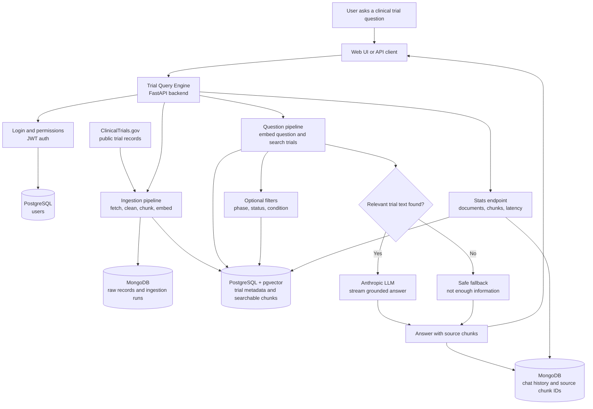

# Trial Query Engine

Trial Query Engine is a retrieval-augmented backend for querying clinical trial data, built on FastAPI, PostgreSQL with pgvector, MongoDB, and streaming responses via the Anthropic API.

It ingests public ClinicalTrials.gov records, chunks and embeds trial text for semantic search, retrieves source material for a natural-language question, and streams back a grounded answer with traceability to the source chunks used.

## What It Does

- Ingests clinical trial records from the public ClinicalTrials.gov API.
- Chunks trial summaries, eligibility criteria, interventions, outcomes, and descriptions.
- Creates local embeddings with `sentence-transformers/all-MiniLM-L6-v2`.
- Stores trial metadata and vector embeddings in PostgreSQL with pgvector.
- Stores raw source records, ingestion runs, and chat history in MongoDB.
- Blends semantic vector search with keyword matching for hybrid retrieval.
- Supports structured filters such as trial phase, status, and condition.
- Streams grounded LLM answers through `/query`.
- Logs retrieved chunk IDs so answers can be traced back to source text.
- Uses JWT auth, role-based access control, security headers, and query rate limiting.
- Returns a safe fallback when retrieved context is insufficient.

## Architecture



PostgreSQL handles structured data, relational filters, and vector search. MongoDB stores raw source records and flexible audit-style data such as chat history and ingestion runs.

## Setup

```bash
uv sync
cp .env.example .env
make docker-up
make docker-migrate
make docker-mongo-indexes
make run
```

Frontend:

```text
http://localhost:8000
```

API docs:

```text
http://localhost:8000/docs
```

## Environment

Copy the example environment file, then fill in any local values you need:

```bash
cp .env.example .env
```

## Common Commands

Run the app:

```bash
make run
```

Run with auto-reload through Uvicorn:

```bash
make dev-server
```

Ingest data:

```bash
make ingest-studies
make ingest-studies CONDITION="Hypertension" MAX_STUDIES=50
make ingest-condition-set
```

`make ingest-condition-set` loads a broad local demo set across Type 2 Diabetes, Breast Cancer, Hypertension, and Asthma with 75 studies per condition by default. This gives about 300 studies without trying to ingest all of ClinicalTrials.gov.

Run checks:

```bash
make test-unit
make test-integration
make check
```

Smoke tests:

```bash
make ingest-smoke-test
make query-smoke-test
```

Useful DB checks:

```bash
make db-ping
make db-current
make db-counts
make db-extensions
```

## Query Example

Create a user:

```bash
curl -X POST http://localhost:8000/auth/register \
  -H 'Content-Type: application/json' \
  -d '{"email":"demo@example.com","password":"secret123"}'
```

Log in:

```bash
TOKEN=$(curl -s -X POST http://localhost:8000/auth/login \
  -H 'Content-Type: application/x-www-form-urlencoded' \
  -d 'username=demo@example.com&password=secret123' | jq -r .access_token)
```

Ask a broad question:

```bash
curl -N -X POST http://localhost:8000/query \
  -H "Authorization: Bearer $TOKEN" \
  -H 'Content-Type: application/json' \
  -d '{
    "question":"What eligibility criteria appear across the available clinical trials?",
    "top_k":3
  }'
```

Ask a filtered question:

```bash
curl -N -X POST http://localhost:8000/query \
  -H "Authorization: Bearer $TOKEN" \
  -H 'Content-Type: application/json' \
  -d '{
    "question":"What interventions are being studied in Breast Cancer trials?",
    "top_k":3,
    "status":"RECRUITING",
    "condition":"Breast Cancer"
  }'
```

## Retrieval And Safety

Retrieval uses hybrid search:

- Semantic score from normalized pgvector cosine similarity.
- Keyword score from exact token matches over chunk text.
- Blended score from `RAG_SEMANTIC_WEIGHT` and `RAG_KEYWORD_WEIGHT`.
- Optional SQL filters for phase, status, and condition.

If no chunks pass retrieval gates, `/query` skips the LLM and returns:

```text
I don't have enough information from the provided trial data to answer that.
```

Each answer is logged with retrieved chunk IDs and chunk UIDs so the answer can be traced back to source trial text.

## Guardrails And Audit Trail

`/query` runs deterministic guardrails before retrieval, after retrieval, and before returning a generated answer.

Input guardrails:

- Prompt-injection patterns such as instruction override attempts.
- PII patterns such as email, phone, SSN-like values, and MRN-like values.
- Scope checks for clinical-trial relevance.
- Maximum question length.

Retrieval guardrail:

- Blocks generation when no retrieved chunks pass relevance gates.

Output guardrails:

- Grounding check based on lexical overlap with retrieved trial chunks.
- PII leakage check on the generated answer.

Guardrail decisions are logged to MongoDB in `guardrail_log` with user ID, query ID, stage, check name, result, detail, and timestamp. Blocking decisions return a structured SSE guardrail event and a clear refusal instead of a generic server error.

## Stats

```bash
curl http://localhost:8000/stats
```

Returns document count, chunk count, query count, average latency, and latest ingestion run metadata.
